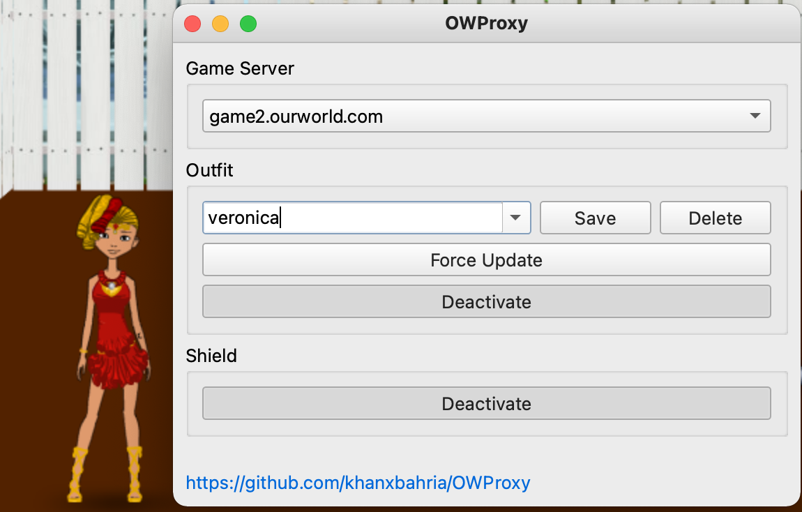

<!-- PROJECT LOGO -->
<br />
<p align="center">
  <a href="https://github.com/khanxbahria/OWProxy">
    
  </a>

  <h3 align="center">OWProxy</h3>

  <p align="center">
    An extensible TCP Proxy written for ourWorld with Outfit Mod & Shield.
    <br />
   <a href="#getting-started">Getting Started</a>


  </p>
</p>


<!-- ABOUT THE PROJECT -->
## About The Project



OWProxy is a custom TCP proxy to manipulate inbound and outbound payloads for ourWorld session.  
The functionality can be extended with custom plugins.  


<!-- GETTING STARTED -->
## Getting Started

## Windows
1. Download the latest Windows release here: [OWProxy for Windows](https://github.com/khanxbahria/releases/latest/download/OWProxy-win64.zip).
2. Extract the folder.
3. Before opening ourWorld client run OWProxy.exe


## Install from Source (Mac OS)

### Prerequisites

Download Python here: [https://www.python.org/downloads/](https://www.python.org/downloads/)

### Installation

1. Download the latest source release here: [OWProxy Source](https://github.com/khanxbahria/OWProxy/archive/refs/heads/main.zip.
2. Extract the folder.
3. Open terminal in the same folder, I am not going to teach you that.
  ```bash
  pip3 install -r requirements.txt
  ```
^ You need to do that just once.


<!-- USAGE EXAMPLES -->
## Usage

[![OWProxy Mac Usage][Screenshot-Mac-Usage]](https://github.com/khanxbahria/OWProxy)

Before opening ourWorld client:  
  Open terminal in the same folder,
  ```bash 
  sudo python3 app.py
  ```  
To close OWProxy, exit the OWProxy window first before closing the terminal.

# Plugins

## Outfit

Lets you wear any possible outfit.
 To save the current outfit, edit the text inside the box and click save.
 A custom outfit can be made within user's Wishlist and selecting that as an option.
  ### outfits folder
  Outfits are loaded from and saved to outfits folder.  
  Additional outfits are added from jess's scripts into a subdirectory, outfits_old. You may choose to move them back to outfits folder to be able to use.
## Shield

This plugin blocks potentially malicious urls, allowing players to be protected from malicious session hijacking.  
Cons: It does not load avatar photos and photo albums when activated.


### Disclaimer

  The code provided is as-is, and there are no guarantees that it fits your purposes.  
  The author shall not be liable for any damage to your account whether incurred directly or indirectly.  
  Use at your own risk.  
  


###  


<!-- MARKDOWN LINKS & IMAGES -->
<!-- https://www.markdownguide.org/basic-syntax/#reference-style-links -->
[Screenshot-Mac-Usage]: images/Screenshot-Mac-Usage.png

